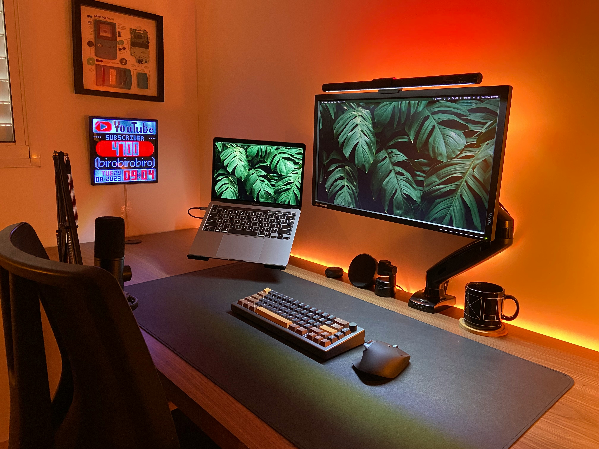
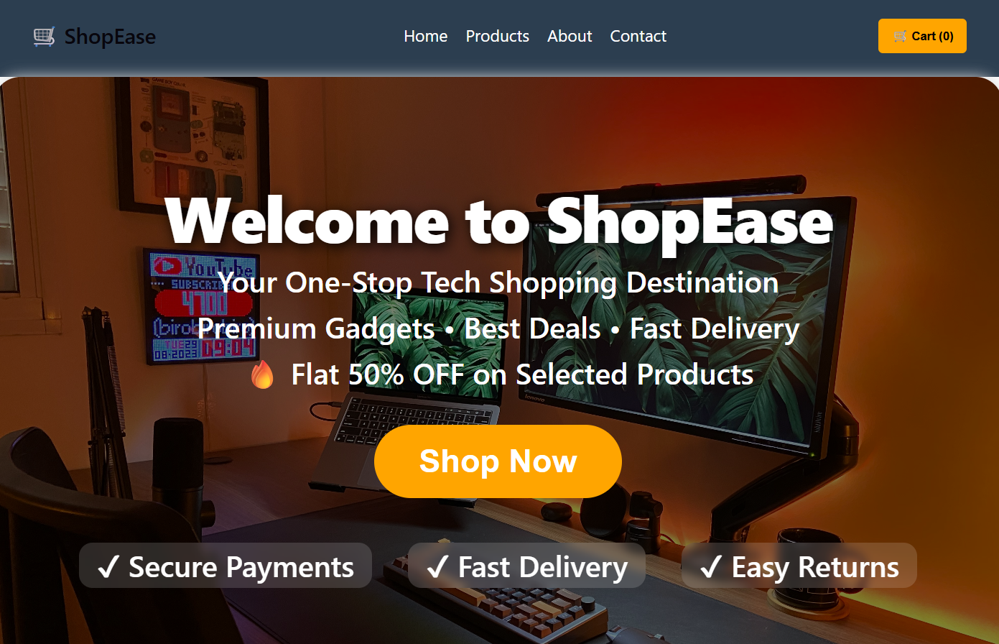
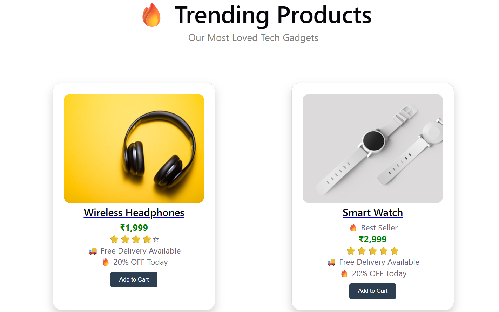
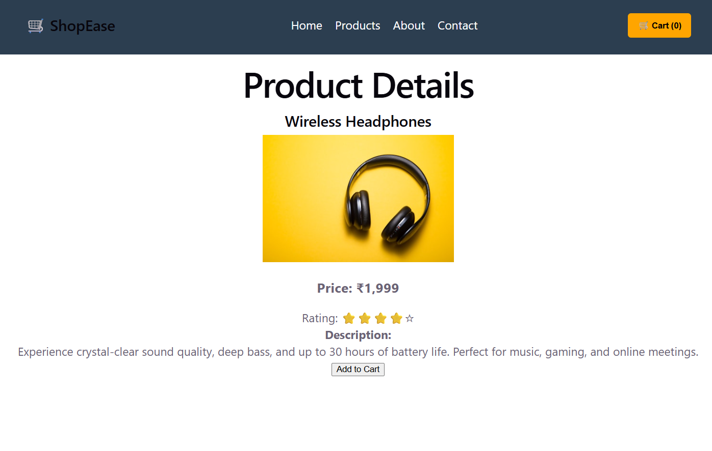
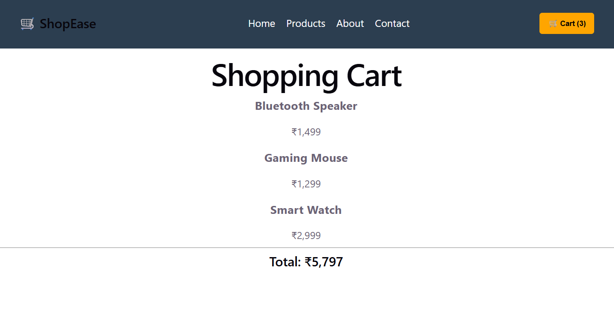

# ShopEase - Ecommerce React Project

A modern and responsive Ecommerce Product Page built using React and CSS. This project allows users to browse products, search items, filter by category, view product details, and add products to the cart.

---

## Features

- Attractive Hero Section
- Responsive Navigation Bar
- Product Listing with Cards
- Product Search Functionality
- Category Filtering
- Product Details Page
- Add to Cart Functionality
- Cart Item Counter
- Trending Products Section
- Special Offers Section
- Best Seller Tags
- Modern and Responsive UI Design

---

## Tech Stack

- React JS
- React Router DOM
- CSS3
- JavaScript (ES6)
- Vite

---

## Folder Structure

```
src/
│
├── assets/
│   └── hero-bg.jpg
│
├── components/
│   ├── Navbar.jsx
│   └── ProductCard.jsx
│
├── data/
│   └── products.js
│
├── pages/
│   ├── Cart.jsx
│   └── ProductDetails.jsx
│
├── App.jsx
├── App.css
├── index.css
└── main.jsx
```

---

## Screenshots

### Home Page


---

### Hero Section


---

### Product Section



---

### Product Details Page



---

### Shopping Cart



---

## Installation

Clone the repository:

```bash
git clone <your-repository-link>
```

Move into the project folder:

```bash
cd Ecommerce-React
```

Install dependencies:

```bash
npm install
```

Run the project:

```bash
npm run dev
```

---

## Learning Outcomes

Through this project, I learned:

- React Components
- React Router DOM
- State Management using useState
- Props Handling
- Conditional Rendering
- Search and Filter Functionality
- Responsive UI Design
- Project Structuring in React
- Git and GitHub Workflow

---

## Future Improvements

- Dark Mode
- Wishlist Feature
- User Authentication
- Checkout Page
- Payment Gateway Integration
- Backend Integration using APIs

---

## Author

Jagriti Rai
