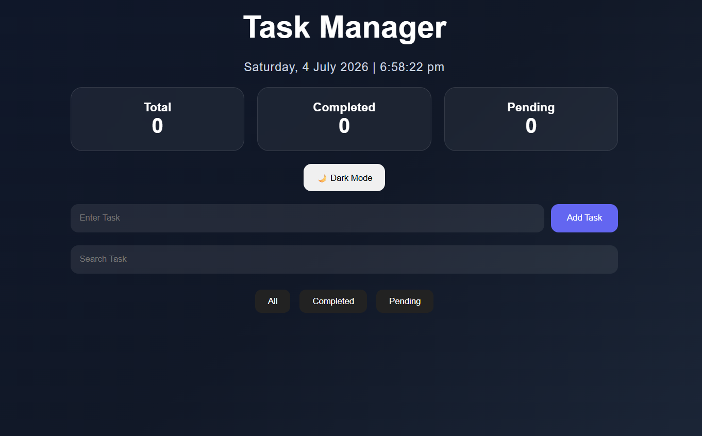
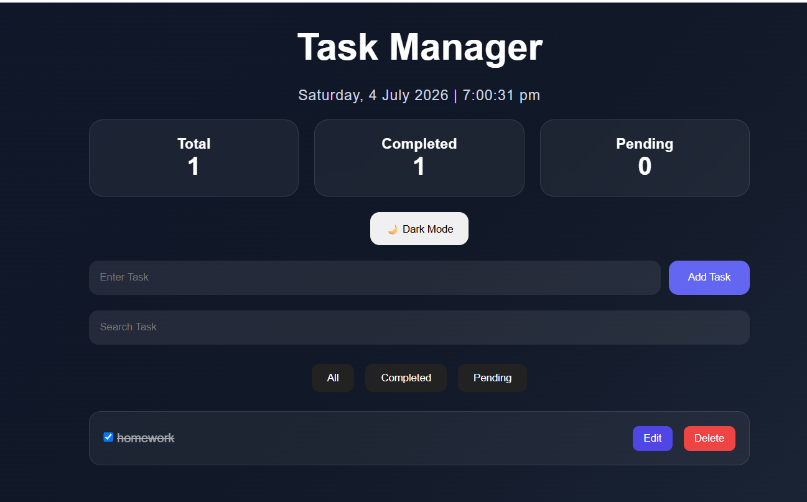
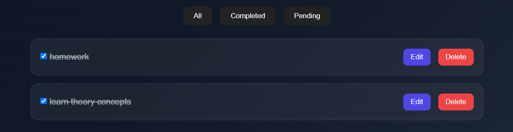
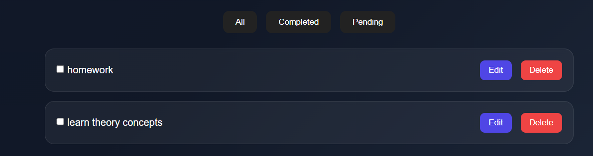
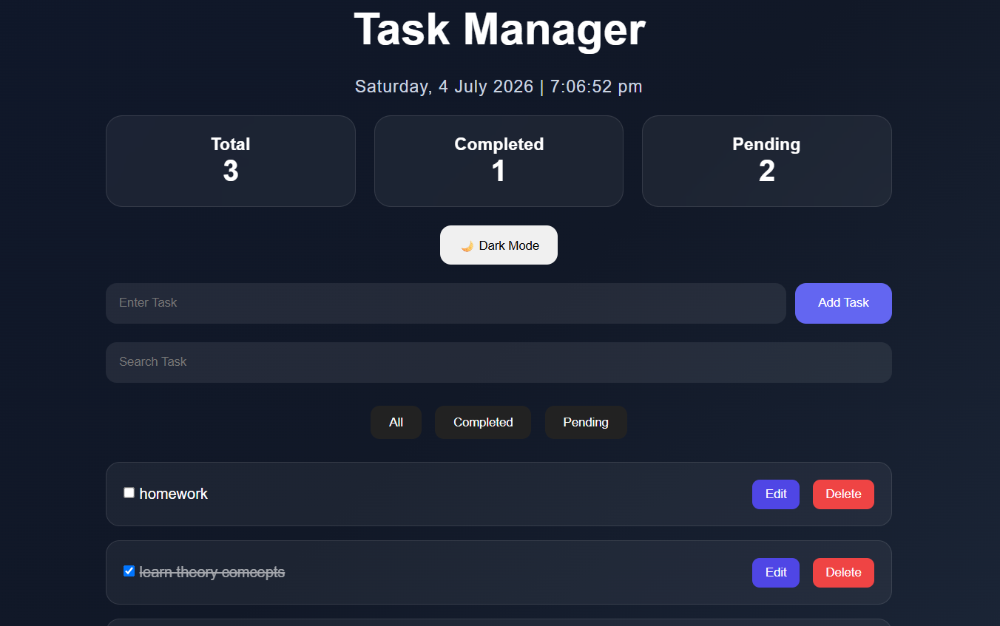
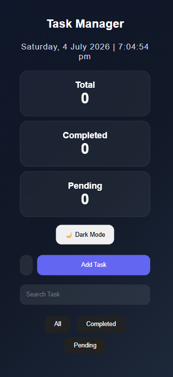

📋 Task Manager

A modern and responsive Task Manager web application built using HTML, CSS, and JavaScript. This application helps users efficiently manage daily tasks with features like task creation, editing, deletion, completion tracking, search, filtering, dark mode, and persistent storage using Local Storage.

---

🚀 Features

* ➕ Add new tasks
* ✏️ Edit existing tasks
* 🗑️ Delete tasks
* ✅ Mark tasks as completed
* 🔍 Search tasks instantly
* 📂 Filter tasks (All / Completed / Pending)
* 🌙 Dark Mode support
* 💾 Local Storage integration
* 📱 Fully Responsive Design
* 📊 Task Statistics Dashboard

---

🛠️ Technologies Used

* HTML5
* CSS3
* JavaScript (ES6)
* Local Storage API

---

📸 Project Preview

Task Manager interface with:

* Task Statistics
* Search Functionality
* Filter Buttons
* Dark Mode
* Local Storage Support

---

## 📂 Project Structure

```text
Task-Manager/
│
├── images/
│   ├── home.png
│   ├── add-task.png
│   ├── completed-task.png
│   ├── edit-delete.png
│   ├── mobile-view.png
│   └── task-list.png
│
├── index.html
├── style.css
├── script.js
├── README.md
```

---

## 📸 Screenshots

### 🏠 Home Screen



---

### ➕ Add Task



---

### ✅ Completed Task



---

### ✏️ Edit/Delete Task



---

### 📋 Task List



---

### 📱 Mobile View



---

▶️ How to Run

1. Download or clone the repository.
2. Open the project folder.
3. Run `index.html` in your browser.
4. Start managing your tasks.

---

🎯 Learning Outcomes

Through this project, I learned:

* DOM Manipulation
* Event Handling
* Local Storage (JSON)
* Responsive Web Design
* JavaScript Functions
* CRUD Operations

---

👩‍💻 Author

Jagriti Rai
