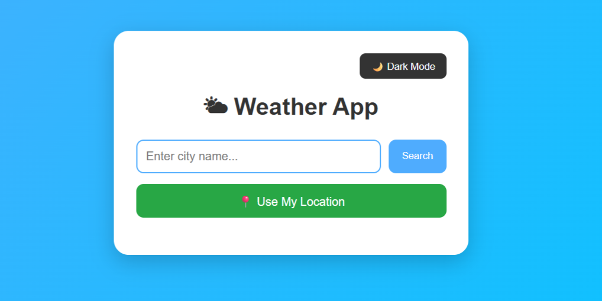
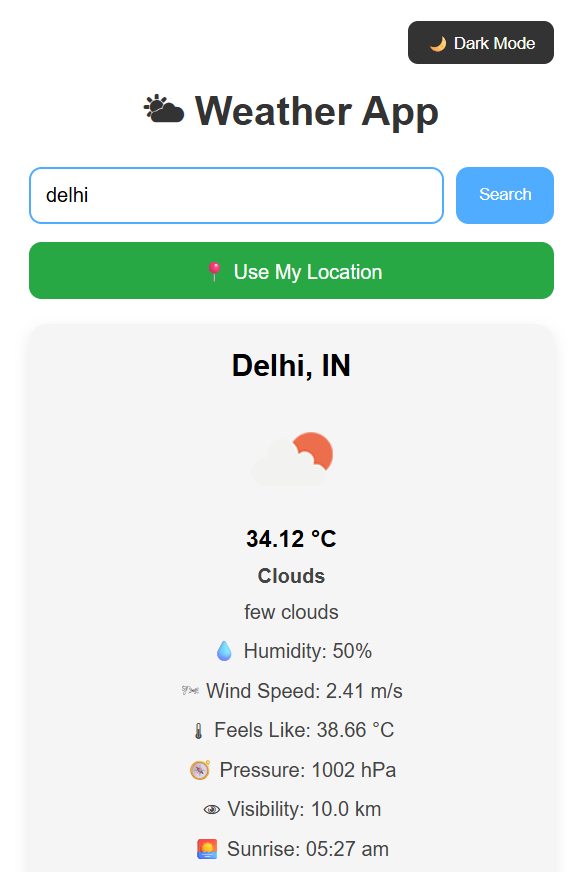
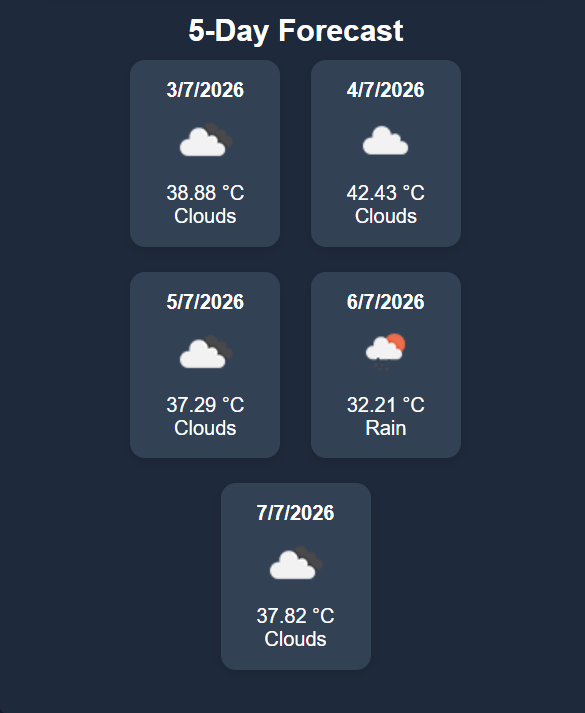
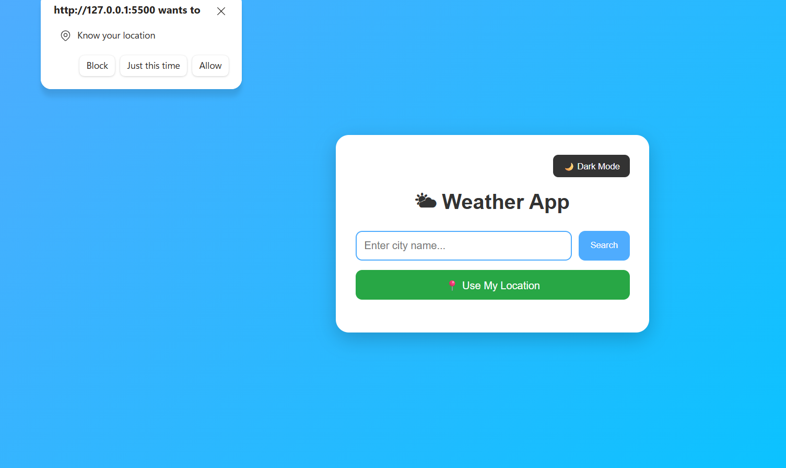
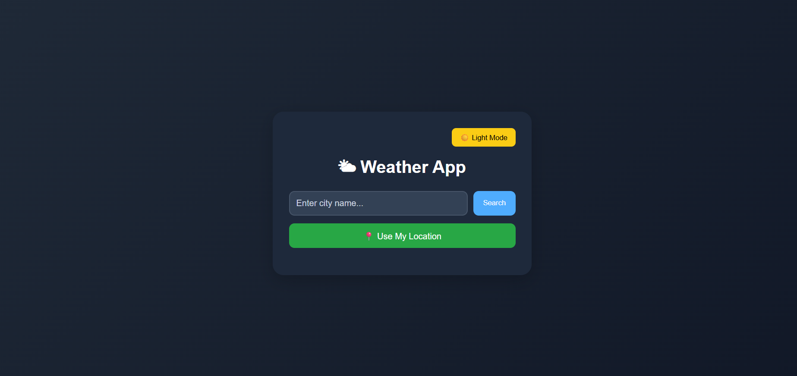
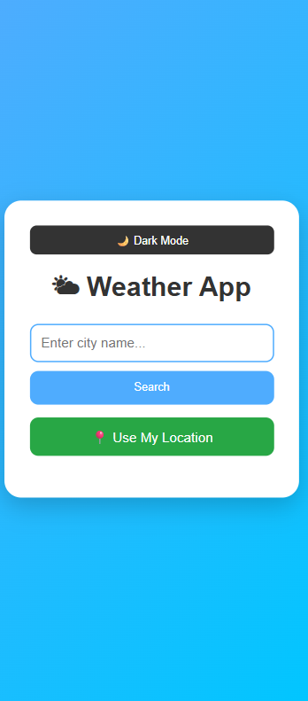

# 🌤 Weather App

A modern, responsive Weather App built using **HTML, CSS, and JavaScript**. It provides real-time weather information and a 5-day weather forecast using the OpenWeatherMap API. The application also supports dark mode and current location weather using the browser's Geolocation API.

---

## 🚀 Features

- 🔍 Search weather by city name
- 📍 Get weather using current location
- 📅 5-Day Weather Forecast
- 🌙 Dark Mode
- 🌡 Current Temperature
- 🤗 Feels Like Temperature
- 💧 Humidity
- 🌬 Wind Speed
- 🧭 Pressure
- 👁 Visibility
- 🌅 Sunrise Time
- 🌇 Sunset Time
- ⏳ Loading Indicator
- ❌ Error Handling
- 📱 Responsive Design

---

## 🛠 Technologies Used

- HTML5
- CSS3
- JavaScript (ES6)
- OpenWeatherMap API
- Geolocation API
- Local Storage

---

## 📸 Screenshots

### 🏠 Home Screen



---

### 🌤 Weather Search Result



---

### 📅 5-Day Forecast



---

### 📍 Current Location Weather



---

### 🌙 Dark Mode



---

### 📱 Mobile Responsive View



---

## 📂 Project Structure

```text
Weather-App/
│
├── images/
│   ├── home.png
│   ├── weather-result.png
│   ├── forecast.png
│   ├── location.png
│   ├── dark-mode.png
│   └── mobile-view.png
│
├── index.html
├── style.css
├── script.js
└── README.md
```

---

## ⚙️ How to Run the Project

1. Clone this repository.
2. Open the project folder.
3. Get your free API key from OpenWeatherMap.
4. Replace the API key in `script.js`.
5. Open `index.html` in your browser.

---

## 📌 Future Improvements

- 🌡 Temperature Unit Toggle (°C/°F)
- 🌍 Air Quality Information
- 🔔 Weather Alerts
- 🎨 Animated Weather Backgrounds
- ⭐ Favorite Cities

---

## 👨‍💻 Author

**Jagriti Rai**

---

